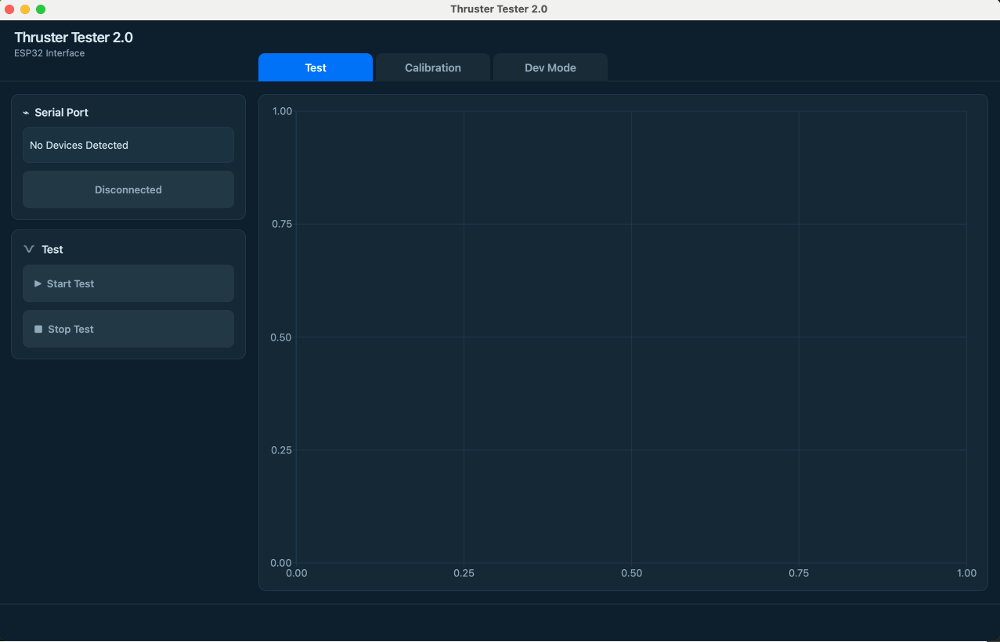

# Thruster Tester 2.0 GUI

Thruster Tester 2.0 is a Qt 6 Widgets application for operating and monitoring the LBCC ROV team's thruster testing system. The application will connect to supported USB devices, run tests associated with thruster and design IDs, graph and save collected data, calibrate and tare load cells, and provide a developer mode for diagnostics and configuration.

See the [Thruster Tester 2.0 GUI overview and requirements](https://lbccd.sharepoint.com/:p:/r/sites/LBCCROVTeam/_layouts/15/doc2.aspx?action=edit&sourcedoc=%7B1d4f0803-5bb1-47b3-baac-34b445ffc2d5%7D&wdExp=TEAMS-TREATMENT&web=1).

## Build and run

Install CMake and Qt 6.5 or newer, then run these commands from the repository root:

```bash
cmake -S . -B build
cmake --build build
```

On macOS:

```bash
./build/appThrusterTester.app/Contents/MacOS/appThrusterTester
```

On Windows with a multi-configuration generator:

```powershell
.\build\Debug\appThrusterTester.exe
```

## Progress so far



Currently implemented and functional:
- **Serial Connection Management**: Auto-detects and filters USB microcontroller ports, handles connect/disconnect states, periodic background port scanning, and surfaces communication errors via an overlay toast.
- **Start Test Trigger**: Start Test button validates connection and transmits the test initiation command (`603\n`) over the serial channel.
- **Interactive Line Chart Component**: Reusable `LineChart` widget integrated into the main Test view with dark-theme styling, coordinate grid, and automatic/explicit axis range support (ready to plot incoming data points once stream parsing is connected).
- **Navigation & Layout**: Three-tab interface (Test, Calibration, Dev Mode) with context-sensitive sidebar controls.
